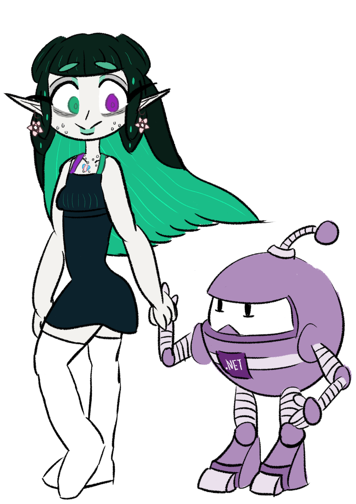

# RiotBlossom
 
[](https://www.nuget.org/packages/BlossomiShymae.RiotBlossom/) [](https://www.nuget.org/packages/BlossomiShymae.RiotBlossom/)



RiotBlossom is the asynchronous, simple, and magical Riot Games API wrapper library for C#!

This library does it best to make things easier to develop with the API. Caching, limiting, and retrying are supported by default. Static data providers such as DataDragon, CommunityDragon, and Meraki Analytics are also covered! ＼(＾▽＾)／

This library is currently compatible with .NET 8 and higher.

### Contributors
<a href="https://github.com/BlossomiShymae/RiotBlossom/graphs/contributors">
  
</a>

---
- [AoshiW](https://github.com/AoshiW)

Made with [contrib.rocks](https://contrib.rocks).

# Table of Contents
- [RiotBlossom](#riotblossom)
    - [Contributors](#contributors)
- [Table of Contents](#table-of-contents)
- [Documentation, tutorials, and more!](#documentation-tutorials-and-more)
- [Features](#features)
- [Installation](#installation)
- [Endpoints](#endpoints)
  - [Riot Api](#riot-api)
    - [League of Legends](#league-of-legends)
    - [Teamfight Tactics](#teamfight-tactics)
    - [Legends of Runeterra](#legends-of-runeterra)
    - [VALORANT](#valorant)
  - [DataDragon](#datadragon)
  - [CommunityDragon](#communitydragon)
  - [MerakiAnalytics](#merakianalytics)
- [Dependent packages](#dependent-packages)
- [Contributing](#contributing)
- [License](#license)
- [Disclaimer](#disclaimer)
- [Appendix](#appendix)
  - [Star History](#star-history)
  - [Inspiration](#inspiration)
  - [Resources](#resources)
  - [Conventions](#conventions)

# Documentation, tutorials, and more!
[Dedicated GitHub pages for RiotBlossom documentation can be found here!](https://blossomishymae.github.io/RiotBlossom/) :3

# Features

Well buddy pal chum... here is what we got!
- Asynchronous, no-conversion API
- Caching (Random access memory, file system, none, or your own)
- Rate limiting (Burst, spread, none, or your own)
- Logging (ILogger)
- Ease-of-use client creation
- Typed data transfer objects, type-safe enums, and exceptions
- Riot Games API support (yep!)
  - League of Legends
  - Teamfight Tactics
  - Legends of Runeterra
  - VALORANT
- Static data support
  - DataDragon
  - CommunityDragon
  - Meraki Analytics
- Love (੭ु ›ω‹ )੭ु⁾⁾♡

# Installation
Install via NuGet, [`BlossomiShymae.RiotBlossom`](https://www.nuget.org/packages/BlossomiShymae.RiotBlossom).
For package manager console:
```
Install-Package BlossomiShymae.RiotBlossom
```
Or the .NET CLI:
```
dotnet add package BlossomiShymae.RiotBlossom
```

# Endpoints
## Riot Api
- ⭕ Account-v1 (no RSO)

### League of Legends
- ✅ Champion-Mastery-v4
- ✅ Champion-v3
- ✅ Clash-v1
- ❌ League-Exp-v4 (will not support, experimental endpoint)
- ✅ League-v4
- ✅ Lol-Challenges-v1
- ✅ Lol-Status-v4
- ✅ Match-v5
- ✅ Spectator-v4
- ⭕ Summoner-v4 (no RSO)
- ❌ Tournament-Stub-v5 (will not support)
- ❌ Tournament-v5 (will not support)

### Teamfight Tactics
- ✅ Tft-League-v1
- ✅ Tft-Match-v1
- ✅ Tft-Status-v1
- ⭕ Tft-Summoner-v1 (no RSO)

### Legends of Runeterra
- ⭕ Lor-Deck-v1 (no RSO, currently not supported)
- ⭕ Lor-Inventory-v1 (no RSO, currently not supported)
- ✅ Lor-Match-v1
- ✅ Lor-Ranked-v1
- ✅ Lor-Status-v1

### VALORANT
- ✅ Val-Content-v1
- ✅ Val-Match-v1
- ✅ Val-Ranked-v1
- ✅ Val-Status-v1

## DataDragon
- ✅ Champions (`championFull.json`)
- ✅ Items (`item.json`)
- ✅ Perks (`runesReforged.json`)

## CommunityDragon
- ✅ Champions ([rcp-be-lol-game-data/global/default/v1/champions](https://raw.communitydragon.org/latest/plugins/rcp-be-lol-game-data/global/default/v1/champions/))
- ✅ Items (`items.json`)
- ✅ Perks (`perks.json`)

## MerakiAnalytics
- ✅ Champions (`champions.json` and individual files)
- ✅ Items (`items.json` and individual files)

# Dependent packages
- Microsoft.Extensions.Logging
- Microsoft.Extensions.Logging.Console

# Contributing
Create an issue or submit a pull request! ˖⁺‧₊˚ ♡ ˚₊‧⁺˖

Before submitting a pull request, be sure to include unit tests if applicable. Unit tests use common objects from 
the [StubConfig file](https://github.com/BlossomiShymae/RiotBlossom/blob/master/BlossomiShymae.RiotBlossomTests/StubConfig.cs). Be sure to include your Riot API key under the `RIOT_API_KEY` 
system environment variable.

# License
This library is under the MIT license.

# Disclaimer
RiotBlossom isn't endorsed by Riot Games and doesn't reflect the views or opinions of Riot Games or anyone officially involved in producing or managing Riot Games properties. Riot Games, and all associated properties are trademarks or registered trademarks of Riot Games, Inc.

# Appendix
## Star History
[](https://star-history.com/#BlossomiShymae/RiotBlossom&Date)

## Inspiration

TheDrone7. *shieldbow,* GitHub, [https://github.com/TheDrone7/shieldbow](https://github.com/TheDrone7/shieldbow)

Samuel, Mingwei. *Camille,* GitHub, [https://github.com/MingweiSamuel/Camille](https://github.com/MingweiSamuel/Camille)

Rua, Rob and Maldonis, Jason J. *Orianna,* GitHub, [https://github.com/meraki-analytics/orianna](https://github.com/meraki-analytics/orianna)

## Resources

Ray and Riot Games. *Rate Limiting,* Hextechdocs, [https://hextechdocs.dev/rate-limiting/](https://hextechdocs.dev/rate-limiting/)

[https://developer.riotgames.com/](https://developer.riotgames.com/)

[https://discord.com/invite/riotgamesdevrel](https://discord.com/invite/riotgamesdevrel) (Note: Searching in this Discord contains aggregated information not found elsewhere)

## Conventions

[https://learn.microsoft.com/en-us/dotnet/csharp/fundamentals/coding-style/coding-conventions](https://learn.microsoft.com/en-us/dotnet/csharp/fundamentals/coding-style/coding-conventions)

[https://learn.microsoft.com/en-us/dotnet/csharp/asynchronous-programming/task-asynchronous-programming-model](https://learn.microsoft.com/en-us/dotnet/csharp/asynchronous-programming/task-asynchronous-programming-model)

